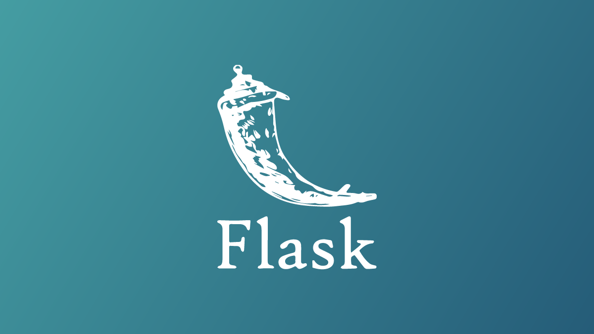

## A Simple Flask App To Calculate Your Date Of Birth And Calculate The Distance Between Today And Your Birth Date

<p align="center">
  
</p>

# Update With Result In Another File
## 📂 Project Structure
```bash
├── assets/
│   └── flask.png                     
├── static/                
│   │   ├── about.css
│   │   └── index.js
│   │   └── flask.png
│   │   └── index.css
│   │   └── index2.css
│   │   └── index3.css
├── templates/
│   │   ├── about.html
│   │   ├── hasil_jarak.html --result in another file
│   │   ├── hasil_umur.htm --result in another file
│   │   ├── index.html
│   │   ├── index2.html
│   │   ├── index3.html
│   │       
└── main.py -- to run           

```
# Flask DateTime Input Example

A simple application to calculate the distance between today's date and your birth date and calculate your age using Flask based on the Python language.
and can automatically update today's date, suitable for hosting

## Features

- Simple Flask application to accept date/time input
- Example HTML form (in `templates/`) to pick date and time
- Static assets in `static/` and supporting images in `assets/`
- Minimal, easy-to-read code you can adapt for learning or small projects

## Requirements

- Python 3.8+
- Flask (or install from requirements if provided)

## Installation

1. Clone the repository:

   git clone https://github.com/Raditya808/flask-app-py-datetime-input.git
   cd flask-app-py-datetime-input

2. (Optional) Create and activate a virtual environment:

   python -m venv venv
   source venv/bin/activate   # macOS / Linux
   venv\Scripts\activate    # Windows

3. Install dependencies:

   pip install -r requirements.txt

   If there is no `requirements.txt`, install Flask directly:

   pip install Flask

## Running the app

There are two common ways to run the application:

- With Flask's development server:

  export FLASK_APP=main.py
  export FLASK_ENV=development
  flask run

  (On Windows PowerShell use `setx FLASK_APP main.py` and `setx FLASK_ENV development`, or run the file directly.)

- Or run directly with Python if `main.py` includes an entrypoint:

  python main.py

By default the app will be available at ```bash http://127.0.0.1:5000``` — open this in your browser to see the form and try submitting a date/time.

## Usage

- Open the app in a browser, fill in the date/time fields and submit the form.
- The app demonstrates basic server-side handling of datetime input (parsing/form validation may be implemented in `main.py`).

## Project structure

- `main.py` — main Flask application entrypoint
- `templates/` — HTML templates (form, results, etc.)
- `static/` — static files (CSS, JS)
- `assets/` — images and other media used in the README or UI

## Customization

- Swap the HTML input types or add a JavaScript date/time picker for better browser support.
- Add server-side validation and timezone handling as needed using `datetime` and `pytz` or `zoneinfo`.


## License

If you want to include a license, add a `LICENSE` file. Otherwise consider adding an MIT or other permissive license.

---

If you want, I can also create a `requirements.txt`, a short CONTRIBUTING.md, or update `main.py` to include `requirements.txt`-style comments. Please tell me what you'd like next.
